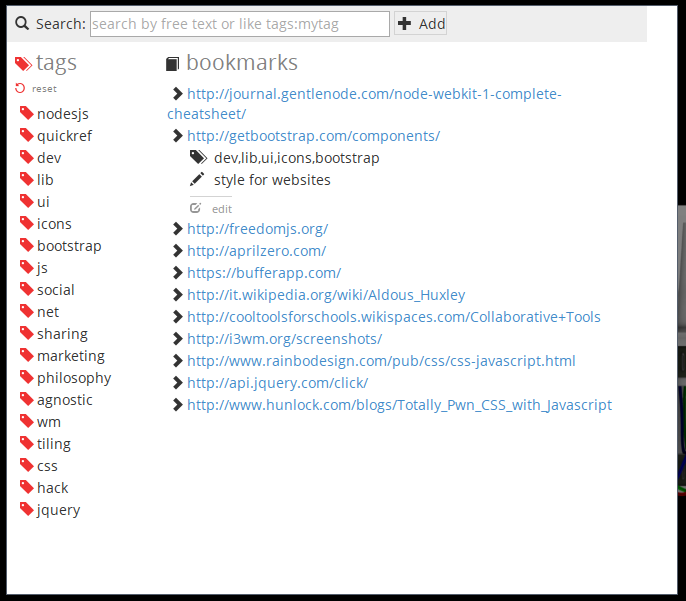

Booktag
=======

Bookmarks! Tagged! On your machine!

I wanted 3 things for bookmarks:

1. to be local - don't want to use an online service just for bookmarks
2. to have tags - which only firefox provides (AFAIK)
3. to be independent of browser - I use dwb/ff/chromium... no browser lock in, no need to "sync" and easily exportable

So, here's Booktag.  
A simple minimalist bookmark manager

----

Use it from CLI or as an App

### Script mode
Use booktag from command line, so that you can put it in a script, assign a keybind etc

$ booktag [site] [tags] [comment]

        $ booktag http://edx.org mooc,courses,education "free courses"

>The only functionality available via cli is to add the bookmark, as for anything else I think
>the app gui is best fit, I see no practical use in a -remove switch or the like

### App mode
Manage your bookmarks.

$ booktag

**Add** and **Search** via the omnibar, **Edit** by expanding the single bookmark arrow

### FAQ
Q: Where are bookmarks stored?
A: Booktag use NeDb, all bookmarks are stored in a single file, JSON format.

    dummyano@caos /booktag/app (git)-[master] % cat data/booktag.db                                                                           :(
        {"www":"http://journal.gentlenode.com/node-webkit-1-complete-cheatsheet/","tags":"nodesjs,quickref","_id":"1JRIlGCniu6L04GJ"}
        {"www":"http://getbootstrap.com/components/","tags":"dev,lib,ui,icons,bootstrap","comment":"style for websites","_id":"1XYYRBVpciXUElMh"}
        {"www":"http://freedomjs.org/","tags":"js,lib,social,net","_id":"5e1xZch8nLPXM9Hc"}
        {"www":"http://aprilzero.com/","_id":"CcJsblqZoiLSwCyV"}
        {"www":"https://bufferapp.com/","tags":"social,sharing,marketing","_id":"DnRe4k1VyH1XZrBu"}
        {"www":"http://it.wikipedia.org/wiki/Aldous_Huxley","tags":"philosophy,agnostic","_id":"GW82D7SU0XxFXetv"}
        {"www":"http://cooltoolsforschools.wikispaces.com/Collaborative+Tools","_id":"SfGhNOt36Z4RUts6"}
        {"www":"http://i3wm.org/screenshots/","tags":"wm,tiling","_id":"U5F2B0KHIlqWIHfW"}
        {"www":"http://www.rainbodesign.com/pub/css/css-javascript.html","tags":"js,css,hack","_id":"gVWfgsFjxjwjXyRe"}
        {"www":"http://api.jquery.com/click/","tags":"jquery,js,lib","comment":"motherfucker js lib","_id":"lpRdW2agzFJPOVE5"}
        {"www":"http://www.hunlock.com/blogs/Totally_Pwn_CSS_with_Javascript","tags":"js,css,hack","_id":"qQZkJNLMrqypQv3f"}

